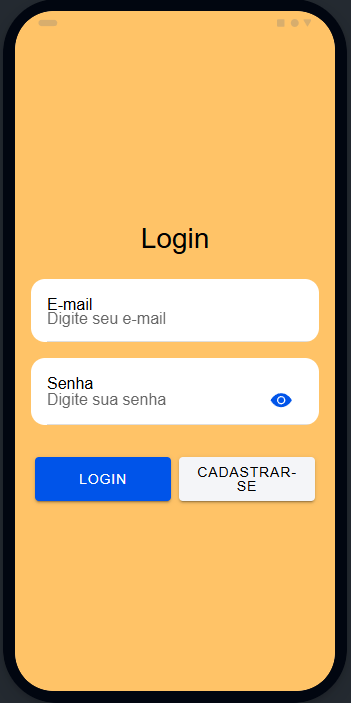
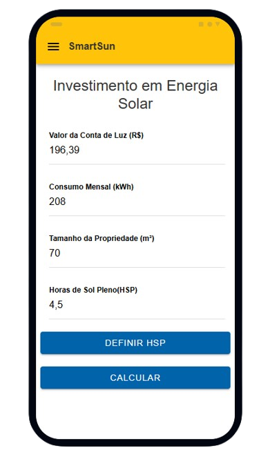
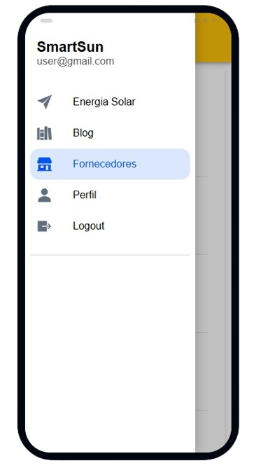
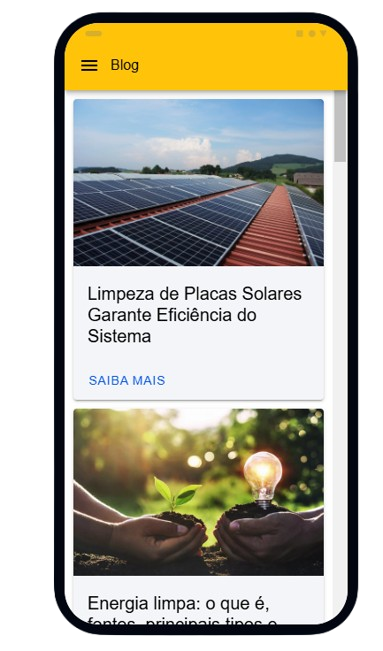

# SmartSun - Investimento em Energia Solar

SmartSun é um aplicativo desenvolvido para auxiliar usuários no planejamento de investimentos em sistemas de energia solar.

## 📖 Descrição
O **SmartSun** é voltado para pessoas interessadas em explorar o potencial da energia solar para reduzir custos e contribuir para a sustentabilidade. Com o SmartSun é  possível saber:
- O **Custo de instalação** baseado no tamanho da propriedade.
- A **Economia anual** estimada após a instalação.
- Tempo de retorno do investimento (**Payback**).
- Comparação entre **custos de energia tradicional** e **energia solar**.

## 🛠️ Ferramentas Utilizadas
O projeto foi desenvolvido com as seguintes tecnologias e ferramentas:
- **Ionic Framework**: Para construção da interface responsiva e compatível com dispositivos móveis.
- **Angular**: Como framework principal para construção do projeto.
- **TypeScript**: Para criação de métodos para realizar as funcionalidades da ferramenta.
- **HTML e CSS**: Para estruturação e estilização das telas.
- **Firebase**: Para autenticação de usuários e armazenamento de dados.


## 💻 Como Usar o SmartSun
Siga as etapas abaixo para utilizar o SmartSun:

### 1. Pré-requisitos
Observações:
  - Certifique-se de ter o **Node.js** instalado em sua máquina.
  - Instale o **Ionic CLI** globalmente:
    ```bash
    npm install -g @ionic/cli
    ```
### 2. Clone esse Repositório: 
- `git clone https://github.com/GitAlvaro-student/SmartSunApp.git`

### 3. Execute o Aplicativo:
- Abra o prompt de comando do Node
- Entre no repositório: `cd SmartSun`
- Execute o projeto: `ionic serve --lab`

### 📸 Algumas Imagens do App






## 💡 Apoie este projeto deixando uma estrela ⭐ no repositório!

